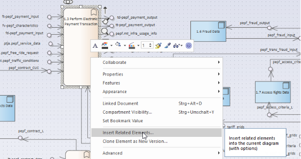

**FRAME ARCHITECTURE TOOL V5.2**

**Document Versioning**

|Date|Author|Version|Status|Granted|
| :- | :- | :- | :- | :- |
|11\.09.2021|Benjamin Witsch|V0.1|Draft||
|01\.05.2022|Benjamin Witsch|V0.2|Draft||
||||||
||||||
||||||

# Acronyms definition

## Functional Areas Acronyms

|**pepf**|1\. Provide Electronic Payment Facilities|
| :- | :- |
|**psef**|2\. Provide Safety and Emergency Facilities|
|**mt**|3\. Manage Traffic|
|**mpto**|4\. Manage Public Transport Operations|
|**padas**|5\. Provide Advanced Driver Assistance Systems|
|**ptja**|6\. Provide Traveler Journey Assistance|
|**psle**|7\. Provide Support for Law Enforcement|
|**mffo**|8\. Manage Freight and Fleet Operations|
|**pa**|9\. Provide Archive|

##  Terminators Acronyms

|**acs**|Atmospheric Conditions Systems|
| :- | :- |
|**ae**|Ambient Environment|
|**au**|Archive User|
|**bti**|Bridge/Tunnel Infrastructure|
|**cc**|Consignor/Consignee, Principal and Freight Forwarder|
|**cc.c**|Consignee|
|**cc.fs**|Consignor Freight Shipper|
|**cc.p**|Principal|
|**d**|Driver|
|**d.e**|Emergency Vehicle Driver|
|**d.fvd**|Freight Vehicle Driver|
|**d.hfvd**|Hazardous Freight Vehicle Driver|
|**d.pr**|Private Driver|
|**d.ptd**|Public Transport Driver|
|**dt**|Dynamic Traveller|
|**es**|Emergency Systems|
|**esp**|External Service Provider|
|**esp.b**|Broadcaster|
|**esp.bsp**|Bookable Service Provider|
|**esp.fsra**|Freight Storage Renting Agency|
|**esp.g**|Geographic Information Provider|
|**esp.gip**|General Information Provider|
|**esp.lp**|Locator Provider|
|**esp.mmtip**|Multi-Modal Travel Information Provider|
|**esp.peo**|Planned Event Organiser|
|**esp.ttip**|Traffic and Travel Information Provider|
|**esp.vra**|Vehicle Renting Agency|
|**fc**|Financial Clearinghouse|
|**feq**|Freight Equipment|
|**ff**|Freight Forwarder|
|**lds**|Location Data Source|
|**lea**|Law Enforcement Agency|
|**mms**|Multi-Modal System|
|**mms.fms**|Freight Management System|
|**mms.mmc**|Multi-Modal Crossing|
|**mms.omfs**|Other Mode Freight System|
|**mo**|Maintenance Organisation|
|**o**|Operator|
|**o.eo**|Emergency Operator|
|**o.flm**|Fleet Manager|
|**o.fro**|Freight Operator|
|**o.po**|Parking Operator|
|**o.pto**|Public Transport Operator|
|**o.rno**|Road Network Operator|
|**o.tio**|Traveler Information Operator|
|**o.to**|Toll Operator|
|**oa**|Other Archives|
|**rp**|Road Pavement|
|**rrs**|Related Road System|
|**t**|Traveler|
|**t.cp**|Car-Pooler|
|**t.cy**|Cyclist|
|**t.p**|Pedestrian|
|**t.ptp**|Public Transport Passenger|
|**t.st**|Static Traveller|
|**tp**|Transport Authorities|
|**tra**|Transport Planner|
|**trfc**|Traffic|
|**v**|Vehicle|
|**v.ev**|Emergency Vehicle|
|**v.fv**|Freight Vehicle|
|**v.hfv**|Hazardous Freight Vehicle|
|**v.hmi**|Human Machine Interface|
|**v.ov**|Other Vehicle|
|**v.p**|Private Vehicle|
|**v.ptv**|Public Transport Vehicle|
|**v.vs**|Vehicle Systems|
|**ws**|Weather Systems|

## General Acronyms

DB	– used to indicate data storage, but its precise form has yet to be defined.

EC	– European Commission

FA	– Functional Area

FAR	– FRAME Architecture Repository – the term for where the FRAME Architecture artefacts will be stored.

FRAME	– the name commonly used for the European ITS Framework Architecture and is derived from the names of the projects that since 2001 have developed its content and the methodology for its use.

HLF	– High-level Function

LLF	– Low-level Function

# Introduction

Today, Intelligent Transport Systems (ITS) form an important technological and organisational basis in the application areas of road traffic. In addition, the importance of information and communication technology for the increasing networking of these systems is also growing and at the same time brings new challenges in the introduction and integration of new systems into existing ITS landscapes. To ensure "intelligent" mobility in Europe, the consistency of information and the associated integration of the corresponding systems are an indispensable prerequisite. This way, ITS is a powerful toolbox to reduce congestion and emissions and to increase the reliability, punctuality and safety of road traffic. To support and simplify the development and operation of ITS, the freely available FRAME Architecture will provide a tool to increase the supply of ITS and its innovation. Based on the experience of the parties involved in the project, the stability of ITS is to be increased and its development methodically supported by design recommendations.

The technical point of view is still often the centre of attention, when talking about creating an ITS service, because the whole service delivery was the responsibility of mainly one entity. However, because of the rapid changes in the ITS domain, this prerequisite applies less and less. The increasing opening of the domain to the private sector, driven by technological and political developments, demands an organizational change for future service creation and operation.

In addition to the technical point of view, the cooperation between the different types of actors that are increasingly becoming involved in the provision of mobility services in terms of content and organisation must also be considered. In fact, ITS services are generally offered jointly by several actors. For example, at national and regional levels road side information is often collected by many road operators, and may then be consolidated on a central platform of a service operator before being made available to navigation service providers. In this example, we therefore have many different actors involved in data collection, data preparation and the provision of an ITS service for an end customer. Each of the actors has its own architecture with its own internal goals, applications and processes. These viewpoints are represented in the ITS pyramid. The pyramid describes the architecture of the individual actors on a high abstraction level.

*Figure 1 ITS Pyramid*

To be able to offer a common ITS service, the different actors must cooperate at a business level and collaborate on a technical level and their architectures should be interoperable at all levels of cooperation (see also [Figure 1](#_ref12284192)). The "business" part of the updated FRAME Architecture, consisting of Overall Concepts and an Organisational View, developed as part of this project will provide the corresponding implementation framework for the realization of comprehensive ITS architectures.

In the FRAME Architecture, basic definitions are made for concepts, standards and mechanisms necessary to ensure the interoperability of distributed communicating applications, components and organisations at different levels. Since terms are often used in different ways in a specific business context, the FRAME Architecture provides formal definitions in a glossary for common understanding. In particular, synonyms and homonyms can make it unnecessarily difficult for partners to communicate correctly and efficiently in practice. The "business" part of the updated FRAME Architecture will provide guidance to identify the business cases of all actors involved and help the actor tasked with the overall implementation to set up the corresponding organisational structures of the service delivery appropriately. Therefore, the definition of roles involved in the value creation chain need to be identified, together with their properties, like capabilities, goals and interests. Views are used to link the parties involved at the business process, value-added and governance levels in a target-oriented manner. This is supported by the Organisational View.

**FRAME Architecture Tool Structure**

A key feature of the FRAME NEXT project has been the introduction of a systematic approach for the inclusion of Business Views in FRAME sub-set architectures, which focus on the enterprise perspectives of ITS Services. This reflects the current paradigm shift in the ITS domain from the provision of technical systems to the delivery of business/public services. After identifying the enterprise (i.e. business/public service) aspects using a number of different headings, the latter were then revised according to the experience gained. The next step has been to devise a method to connect the results of this process with the current FRAME architecture, and to adapt the FRAME methodology accordingly.

*Figure 2 Overview and structure of FRAME*

FRAME as a term embraces three elements: methodology, architecture and tools. The FRAME Architecture is a repository of User Needs and functions, which are grouped into several Functional Areas. In the project FRAME NEXT, the methodology has been enriched by the possibility to extend the Overall Concepts, Organisational Views and Communications Views in a more systematic manner than before. 

The FRAME Methodology employs the FRAME Architecture while also utilising the building blocks, glossary and definitions to provide a clear procedure for the ITS architect to develop ITS service architectures. FRAME NEXT incorporates the building blocks for the Overall Concepts, Organisational View and some extensions to the Communications View into the FRAME Architecture and has amended the FRAME methodology accordingly. 

The last element is the FRAME Tool, which enables the ITS architect to create ITS architectures as sub-sets of the FRAME Architecture to implement one or more ITS services. In the FRAME NEXT project, this tool will be completely renewed and brought up to a state of the art technical solution.

#  FRAME Architecture Elements

## Overview

Within the FRAME NEXT project, the way of thinking about the building blocks of the architecture has changed. Until now, the architecture was strictly organised in views, which were the organising structure for the building blocks. This made it necessary to decide on a specific view for each building block. This is called a diagram-based approach. 

The updated version of the FRAME Architecture will be using a model-based approach, thus not having to decide which view is appropriate for a specific building block. Instead, the focus is on the building blocks and the links between them, making the question on views secondary. Of course, views will be used to present different aspects of the architecture, but the views can be modified at any point to better reflect the needs of the ITS architect.

*Figure 3 FRAME meta model*

[Figure 3 FRAME meta model](#_ref91152003) depicts the structure and elements of the "business" part of the updated FRAME Architecture integrated in the existing meta model of FRAME artefacts. It structures the FRAME artefacts into five sections, inspired by Archimate. The first four sections develop from a high-level perspective down to more technical details the service. The last layer contains artefacts, which are relevant for all sections. The sections are:

1. Motivational Layer:

   In this section, the reasons of the current effort to create the service as well as the goals, relevant stakeholders and the scope of the service are documented. The intention of this section is to formulate an idea of the service, to get an impression of the intended result of its use and to identify the conditions under which it will be used. Naturally, each stakeholder has some aspirations regarding the participation in the value creation. These will be noted in the building block "Desired business results" of the ITS service. Stakeholders might also have specific requirements regarding the architecture of the service which are collected in the “Desired architecture goals”. 

1. Business Layer

   In this section, the organisational structure of the service, the detailed description of the features and processes are documented. Particularly, the different roles, which are necessary for the service and will be taken by suitable actors, and their involvement in the processes. The roles are characterised by their responsibilities and required capabilities. The roles are the executing parties in the processes which operationalise the service. The governance of the service is documented by using agreements between the roles. Part of the Business Layer is also the list of relevant User Needs. These form the functional requirements of the service. The artefact “ITS Service” contains the main facts about the service.

1. Application Layer

   In this section, the functionalities of the service and the respective applications are documented. The applications use low-level functions and are hosted by components (Data Layer). The structure of the FRAME functions was preserved as it was in the selection tool. This helps to organise and browse the functions.

1. Data Layer:

   In this section, the communication parts of the service, namely information objects, data stores, components and used interfaces are documented. 

1. External:

   This section contains cross section artefacts like requirements and specifications. Requirements emerge on all levels and therefore, the artefact is linked to elements in all sections. The same applies to specifications.

The Organisational View contains aspects related to the organisation and actor specific business results from delivering the service. The "Value creation network" building block describes the steps which lead in the end to the delivery of the added value for the end user. This building block indicates the steps to be taken and the required roles for the successful service delivery. More detailed descriptions of participating roles, including their responsibilities, required capabilities and expected behaviour are given in the building block "ITS Roles". For each role, a specific actor[^1] or an actor stereotype[^2] will be assigned. Naturally, each actor has some aspirations regarding the participation in the value creation. These will be noted in the building block "Desired business results" of the ITS service. Finally, the processes of the service delivery are defined, including the roles in which the respective actors are involved.

The last section is already covered by the existing FRAME Architecture, but a different view on these elements is given. It concentrates on specifications related to interoperability on multiple levels. First, the actors need to ensure cooperative working with related actors involved in the same business processes. The second level of interoperability is to make sure, that this service will function in the context it will be delivered in, e.g. by using domain related standards and communication profiles.

## Building Blocks Motivational Layer

### Introduction

The following sections describe the newly added building blocks in greater detail.

### ITS Domain...
- is a concept that divides the distributed and complex variety of applications of Intelligent Transport Systems (ITS services) into specific fields of application, in which sector specific knowledge on the subject of ITS (domain knowledge) is applied. Additional architectural knowledge on the subject of ITS in this domain is applied in ITS architecture related projects.
- determines and defines the borders of the ITS System or service of consideration at the beginning of an ITS architecture project in order to make it manageable and distinguish it from other similar or adjacent ITS systems or services of consideration. Contributes to a first definition of the system boundaries and the interfaces to external systems that need to be supported in the Its Architecture chapter later.
- the ITS Domain in which the Service(s) to be included in the proposed ITS deployment are to operate.  The parameters that can be provided are shown in [Table 4](#_ref16249484) below.

*Table 4 – Overall Concepts – ITS Domain Artefacts*
|**ITS-domain**|**ITS Service 1**|**ITS Service 2**|**\*\*\*\***|**ITS Service n**|
| :-: | :-: | :-: | :-: | :-: |
|**ITS-Service Name**|||||
|**ITS Service ID**|||||
|**ITS-Service Type**|||||
|**Transport Network**|||||
|**Level of Detail**|||||
|**Perspective**|||||
|**Focus**|||||

- The ITS Service ID artefacts is compulsory and is automatically assigned by the software driving the input process.  But the "ITS Service Name" is optional.  All other artefacts are optional and they should be used to contain the following information:
- ITS-Service Name	The name of the ITS Service;
- ITS-Service Type	The type of ITS Services that will be provided, e.g. management, providing travel information, trip planning and EFC;
- Transport Network	The transport network(s) in which the ITS Services will operate;
- Level of Detail	A list of the Architecture Views (i.e. Functional, Physical, Organisational, Communications plus Safety & Security) that will be developed for the ITS Service(s);
- Perspective	A brief description of the related transport policy (or policies) that the ITS Service(s) will support.
- Focus	The main focus of the completed sub-set ITS architecture that will be created to support the ITS Service(s)

### ITS Service...
- is an ITS Architectural artefact (see ITS Service) which describes a value-added service of ITS actors in the field of transport, traffic and mobility for ITS end-users.
- To create the ITS added value, these ITS actors can combine technologies, organisations, processes and people (which represent ITS costs). The ITS Service can be delivered by one ITS actor alone or in cooperation with other ITS actors and stakeholders.
- creates an ITS added value, which may consist of the following elements:
  - an individual ITS benefit for mobile travellers, i.e. a personalised ITS service benefit for individual ITS end-users, for which they are - directly or indirectly - prepared to pay (if user financing of the ITS service is planned), or
  - a collective ITS service benefit, i.e. an ITS effect tailored to ITS end-user groups or the society as a whole, for which the public sector, as a representative of policy and society, is prepared to use tax revenue or charges(tax or fee financing of the ITS service), or
  - a mixture of both components, when public and private ITS actors work together to create a service and hereby create an additional value in the mobility domain.

*Table 5 – ITS Service Artefacts*
|**Artefacts**|**ITS Service 1**|**ITS Service 2**|**\*\*\*\***|**ITS Service n**|
| :-: | :-: | :-: | :-: | :-: |
|**ITS Service Group Name**|||||
|**ITS Service Name**|||||
|**ITS Service ID**|||||
|**ITS Service Short description**|||||
|**ITS Service Field of application**|||||
|**ITS Service Vision**|||||
|**ITS Service Qualitative ITS Goals**|||||
|**ITS Service Implementation Barriers and Reservations**|||||
|**ITS Service Functional and Technological Aspects**|||||

- The "ITS Service ID" and "ITS Service Name" artefacts are compulsory and are taken from the previous table.  But the "ITS Service Group Name" is optional and only needed if the proposed ITS architecture is to support more than one ITS service.  All other artefacts are optional and they should be used to contain the following information:
- ITS Service Short description	Characteristic features of the ITS service category or ITS service
- ITS Service Field of application	Motorway, federal highways, urban environment….
- ITS Service Vision	Long-term objective pursued with the ITS service category or ITS service.
- ITS Service Qualitative ITS Goals	Qualitative ITS benefit or qualitative ITS effect
- ITS Service Implementation Barriers and Reservations
  Qualitative assessment of the complexity of the implementation (technological, functional, organizational, regulatory), the implementation period and rough estimate of the implementation costs.
- ITS Service Functional and Technological Aspects
  Short description of any vital parts of the functionality, e.g. protect privacy, and any technological barriers to the implementation.

### ITS Service added value...
- is created when ITS end-users are given access to ITS information within application processes via easily accessible ITS service access points (in the simplest case, for example, by a private individual using their smartphone) in order to be able to make their own ITS decisions safely, reliably, quickly and effectively.

By supporting end-users in their decisions the road and transport sector can contribute to improving the quality of life of individuals. This demand is reinforced by the definition of the four overall objectives of transport policy:

- Increased road safety,
- satisfying mobility needs,
- reduced environmental impact and
- improved economic efficiency.

ITS-services used by many mobile travellers have an impact on these objectives if they are implemented in a similar and easy-to-use way all over Europe. The aim is to reduce problems or improve specific situations in the regional and/or supraregional transport system and networks by means of targeted ITS measures which might take into account the use of several transport systems and means.

|**Added value of the ITS-service for the "customer"**|**Customer 1**|**Customer 2**|**\*\*\***|**Customer n**|
| :- | :-: | :-: | :-: | :-: |
|In terms of safety (What safety gain should be achieved?)|||||
|In terms of efficiency (What efficiency improvements should be achieved?)|||||
|In terms of environmental impact (What environmental improvements should be achieved ? E.g. emission reductions)|||||
|In terms of other benefits (What other benefits are to be achieved? E.g. traveller comfort)|||||

### ITS Mission statement...
- formulates a clearly structured, overarching, long-term policy objective and the benefits for the defined ITS service deployment that takes into account the interests of stakeholders and end users
- represents the long-term framework for strengthening the security of action and investment for the actors involved. Through its intermodal design, it involves all modes and means of Transport

|**ITS Mission Statement**|**ITS-Mission statement 1**|**ITS-Mission statement 2**|**\*\*\***|**ITS Mission statement n**|
| :- | :- | :- | :- | :- |
|**Guiding principle**  (Vision or mission, formulated as achieved target status)|||||
|**Explanatory component**  Content-related explanations (also understandable for external parties)|||||

### Desired architecture goals …
- is an ITS architecture building block with which a first "high-level" version of the ITS architecture for an ITS service category or a specific ITS service is developed.
- is typically focused - at a high level -more on the breadth of the requirements and less on their depth.

Availability and accessibility of EU wide mobility data

<table><tr><th colspan="1" rowspan="2" valign="top"><b>Stakeholder</b></th><th colspan="1" rowspan="2" valign="top"><b>ITS Architecture target field (i.e. interoperability, security, use of standards...)</b></th><th colspan="1" rowspan="2" valign="top"><b>ITS Architecture Vision</b></th><th colspan="2" valign="top"><b>ITS architecture goals</b></th><th colspan="1" rowspan="1" valign="top"><b>ITS Architecture Action Options</b></th><th colspan="2" valign="top"><b>ITS Architecture Action Patterns</b></th></tr>
<tr><td colspan="1" valign="top">Goals - Which status should be achieved in the end, which conditions should be fulfilled in the end?</td><td colspan="1" valign="top">Objectives - Where does one want to end up at what point in time and how measurable?</td><td colspan="1" valign="top">ITS Architecture Strategies</td><td colspan="1" valign="top">ITS Architecture Tactics</td></tr>
<tr><td colspan="1" valign="top"><b>Implementing body 1</b></td><td colspan="1" valign="top"></td><td colspan="1" valign="top"></td><td colspan="1" valign="top"></td><td colspan="1" valign="top"></td><td colspan="1" valign="top"></td><td colspan="1" valign="top"></td><td colspan="1" valign="top"></td></tr>
<tr><td colspan="1" valign="top"><b>Implementing body 2</b></td><td colspan="1" valign="top"></td><td colspan="1" valign="top"></td><td colspan="1" valign="top"></td><td colspan="1" valign="top"></td><td colspan="1" valign="top"></td><td colspan="1" valign="top"></td><td colspan="1" valign="top"></td></tr>
</table>

### Stakeholder Representatives
Stakeholders are usually non-IT decision makers, e.g. politicians, land-use planners, high-level managers and others who usually have little or no knowledge of IT systems design and implementation beyond what they have acquired as end users.  They will need to be identified and described using the artefacts shown in [Table 1](#_ref16073156) below.

*Table 1 – Stakeholders – General Artefacts*
|**Artefacts**|**Stakeholder Name**|**Stakeholder Contact**|**Stakeholder Interest**|**Stakeholder ID** |
| :-: | :-: | :-: | :-: | :-: |
|**Stakeholder 1**|||||
|**Stakeholder 2**|||||
|**\*\*\*\***|||||
|**Stakeholder n**|||||

The "Interest" artefacts provides a way of identifying the role that the Stakeholder is expected to play in the (implementation of) the ITS Service(s) to be supported by the sub-set ITS architecture to be created from the FRAME Architecture.  These roles will be those who either:

- Want the Service(s)	–	e.g. Local Authorities, Road Operators
- Make the Service(s)	–	e.g. Component Suppliers, Infrastructure Providers
- Use the Service(s)	–	e.g. Travellers, Freight Shippers
- Rule the Service(s)	–	e.g. National Governments, EU, Standards

Those who are classed as "Service Providers", e.g. Mobility or Information Providers, may fall into a combination of the "Want", "Make" or "Use" categories.  The choice of role(s) will be influenced by whether the Service is to be provided because of a statutory requirement, or as a commercial enterprise.  Thus all Stakeholders will have different expectations of the ITS Services that are to be implemented.

Stakeholders will be asked to provide their "Aspirations" which are descriptions of the Services that they want to see the ITS deployment provide.  The provision of the Services may either be by the Stakeholders themselves, or by others, depending on which of the role(s) identified in section [7.2](#_ref15990071) each Stakeholder is going to take.  The Service descriptions almost always relate to people making journeys, those wishing to move freight and those who manage both of these activities.  The artefacts shown in [Table 3](#_ref16249996) are needed to define the Stakeholder Aspirations and their relationships with other steps in the FRAME methodology.

*Table 3 – Stakeholder – Aspiration Artefacts*
|**Name**|**Stakeholder Aspiration 1**|**Stakeholder Aspiration 2**|**…**|**Stakeholder Aspiration n**|
| :-: | :-: | :-: | :-: | :-: |
|**Stakeholder ID** |||||
|**Stakeholder Aspiration ID**|||||
|**Description**|||||
|**Related IT Service ID**|||||

The identity and other information about each Stakeholder will be provided in [Table 1](#_ref16073156) above.  It is almost certain that each Aspiration will be related to several other FRAME artefacts, be they User Needs, Overall Concepts, or artefacts in the Physical, Communications, Organisational and Safety and Security Views.  The relationship to the functionality in the Functional View is provided through the User Needs and this will be defined later – see section [7.6](#_ref16073616).

### ITS Role …

- is an **ITS architecture artefact** that defines and semantically describes the stereotypes of, ITS responsibilities, ITS tasks and finally ITS capabilities that are typical and necessary for the value creation of ITS services.
- is a **significant component of ITS value-added chains for ITS information logistics**, which is taken by ITS actors and ITS stakeholders depending on the requirements of the ITS service to be implemented, whereby a single ITS actor or ITS stakeholder can occupy one or more ITS roles.
- **operates** its ITS capabilities, ITS responsibilities and tasks in the form of **activities** which, together with the activities of other ITS roles, constitute the **ITS business process** of an ITS service.
- is taken in **ITS reference architectures by stereotypes of ITS actors**, in **ITS architectures of real ITS services by concrete instances of stereotypes of ITS actors**.

|**Master data of the ITS Role**|**Role 1**|**Role 2**|**Role 3**|**\*\*\***|**Role n**|
| :-: | :-: | :-: | :-: | :-: | :-: |
|Name of the ITS Role (as part of the ITS Value chain/network)||||||
|View of the ITS Role (**R**=Regulating, **E**=Economical, **T**=Technical, **M**=Minor role)||||||
|ITS key issue of the ITS Role (as part of the ITS Value chain/network)||||||
|Value of the ITS role (According to Power Grid)||||||
|||||||
|Areas of responsibility||||||
|Tasks||||||
|Processess ||||||
|Interactions with other roles||||||
|**Data and information**||||||
|Required data / information||||||
|Generated data / information||||||
|**ITS-Capabilities** (necessary to fulfill the ITS Role)||||||
|ITS Capability 1||||||
|ITS Capability 2||||||
|ITS Capability 3||||||

## Building Blocks Application View

### ITS Actor stereotype/ITS Actor

- is **part of an ITS value-added chain/network** and as such directly **involved in value creation**.
- contributes to the added value of ITS benefits by contributing and using its ITS capabilities as part of its ITS activities as part of the ITS (Value Added Value) business process.
- usually also **represents the interests of ITS stakeholders** who are not themselves directly involved in the ITS value chain/ITS value-added network but who have strong interests associated with it.
- also includes the **ITS end-user** as a special ITS actor.

|**Corresponding ITS Role**|**Actor 1**|**Actor 2**|**\*\*\***|**Actor n**|
| :-: | :-: | :-: | :-: | :-: |
|**Role 1**|||||
|**Role 2**|||||
|**Role 3**|||||
|**\*\*\***|||||
|**Role n**|||||

**Business expectations of an actor involved in the ITS Service...**

- is an **ITS architecture building block**, which formulates the economic added value for an institution/company associated with an ITS service as a goal.

||**Actor 1**|**Actor 2**|**Actor 3**|**\*\*\***|**Actor n**||
| :- | :-: | :-: | :-: | :-: | :-: | :- |
|**Project related expectations/benefits (shortterm)**|||||||
|Where does the ITS Actor want to end up at the end of the project and how can that be measured?|||||||
|**Expected behaviour/actions/tactics**|||||||
|
Which patterns of action are best suited to achieving the goals set?

Which behaviours are best suited for achieving the goals set?
|||||||
|**Overall strategic orientation (longterm)**|||||||
|
Long-term target that may never be achieved.

Which status should be achieved in the end, which conditions should be fulfilled in the end?
|||||||

### ITS Business process...

- is an **ITS architecture artefact** **(see** [ITS Business Process](http://wikiits.albrechtconsult.com/index.php?title=ITS_business_process_template)**)** with which main **activities ITS** roles are linked (on the various fields of activity of a value chain/added-value network) that **implement/operationalize an ITS service** in total.
- In more detail this implies the functions they cover or operate for the service and the capabilities they require/ or need to be able to make this contribution
- uses ITS information objects to exchange information between the functions or activities of ITS roles and **ITS applications (IT services) based on standardised interfaces** to access the information objects.

|**Master data**|**Process 1**|**Process 2**|**\*\*\***|**Process n**|
| :- | :-: | :-: | :-: | :-: |
|Process name|||||
|Process responsible|||||
|from ... to (start and end point)|||||
|**Explanation**|||||
|Process purpose|||||
|Process goal|||||
|**Content**|||||
|Process input|||||
|Process output (results)|||||
|Sub processes|||||
|**Process participants**|||||
|ITS roles|||||
|ITS services|||||
|Information objects|||||
|**Measurement variables**|||||
|Process variable|||||
|Process target value|||||
|Regulations and guidelines|||||

### ITS Application...
- is an ITS architecture building block and consists of a computer program or system of computer programs that automate or implement useful functions.
- can be implemented in a service-oriented architecture.
- uses ITS interfaces for communication with other ITS applications.
- realises technical activities in an ITS business process.
- supports human activities in an ITS business process.

|**Identification**|** ITS Application 1|ITS Application 2|\*\*\*|ITS Application n|
| :- | :- | :-: | :-: | :-: |
|Application name| ||||
|**Description**| ||||
|Short description of the application| ||||

## Linking Stakeholder Aspirations to User Needs
Although only represented by a line in [Figure 3](#_ref16005468), there will be a need to define the relationship between the Stakeholder Aspirations and the User Needs.  This can only be done manually by the FRAME End Users and is, to some extent, open to interpretation, so it may be necessary for different individuals to undertake their own allocations, compare results and resolve the differences.  The artefacts will be as shown in below.

*Table 7 - Stakeholder Aspirations to User Needs relationships*
|**Artefact**|**Stakeholder Aspiration Description**|**User Needs Number**|**User Needs Description**|
| :-: | :-: | :-: | :-: |
|**Stakeholder Aspiration ID – 1**||||
|**Stakeholder Aspiration ID – 2**||||
|**….**||||
|**Stakeholder Aspiration ID – n**||||

The tool that enables the FRAME methodology to be implemented must require the FRAME End User to provide the Stakeholder Aspiration ID for which it will provide the associated description.  A list of all the User Needs together with their descriptions should be available for the FRAME End User to select those that are most appropriate for each Aspiration.  This means that it must be possible to associate several User Needs with one Aspiration and for the same User Need(s) to be associated with two or more Aspirations.

### ITS Information object...
- is an ITS architecture building block that describes the semantic meaning of information related to content.
- is used as input or output in ITS business processes.
- is described and used in ITS data models.

|**Identification**|ITS Information object 1|ITS information object 2|\*\*\*|ITS information object n|
| :- | :-: | :-: | :-: | :-: |
|Name of the information object|||||
|**Description**|||||
|Short description of the information object|||||

## Functional View

### Introduction

Creating the Functional View involves using the User Needs identified as representing the Stakeholder Aspirations to enable the functionality needed to provide the Service(s) to be identified.  Each Functional View must be given a unique name by the FRAME End User.

The functionality to be included in a Functional View will be a sub-set of what is in the complete FRAME Architecture and, usually, does not need to be added to by the FRAME End User.  The exception is when extra new functionality needs to be added by the FRAME End User to provide Service(s) that are currently not included in the FRAME Architecture.  After successfully completing the creation of the new ITS architecture, the FRAME End User has the option (and will be encouraged) to share this new functionality with the FRAME Architecture maintenance team, which may choose to make it a permanent part of the Architecture for everyone to use.

The new FRAME End User tool will ensure that enough functionality is included to make the Functional View logically consistent, i.e. the necessary input data is collected, is processed and then used to provide the required information and/or control output in the required locations and on the required devices.  It should not be possible to create Physical Views from a Functional View that does not fulfil this requirement.

In this part of the methodology, FRAME End Users are in many ways acting as the manager of the process to create the Functional View.  Yes, they have to provide inputs but this is usually to confirm and/or modify the functionality that has already been selected and is available from the tool that enables the FRAME End Users to use the FRAME methodology.

### What is the functionality

The functionality in the FRAME Architecture consists of the following artefacts all of which have already been defined:

1) Functions: these are sometimes called "processes" as they describe an action or actions.  These actions always involve receiving or collecting input data, processing it, and either passing it on to another Function, or sending it out as information or control instructions to an external entity, e.g. a variable message sign, a traffic signal controller, or an in-vehicle display.  Functions may take one of the following forms:
1) Functional Area (FA): a group of Functions that are concerned with a particular aspect of ITS, e.g. providing support for emergency services when incidents occur, managing the road network, managing Public Transport operations and providing assistance to travellers.  Functional Areas have components that may be a combination of High-Level and/or Low-Level Functions.
1) High-Level Function (HLF): this is the next level down from the Functional Area and contains a group of functions that are concerned with a particular part of the data processing.  A High-Level Function will always have component Low-Level Functions, but may be part of a Functional Area or a High-Level Function at a higher level.
1) Low-Level Function (LLF): is the last level down in the Functional Area and performs one particular part of the data input, process or information output process.  A Low-Level Function can be part of a Functional Area or a High-Level Function, but it has no component Functions.  User Needs are allocated to Low-Level Functions.

Only Low-Level Functions are used in the FRAME Methodology.  The Functional Areas and High-Level Functions are produced as part of the FRAME Architecture creation and maintenance processes as a mechanism to control the complexity.  The artefacts that are used to describe Low-Level Functions are shown in [Table 8](#_ref16004749) below.

*Table 8 – Functional View - Function Artefacts*
|**Artefact**|**Function Number & Name 1**|**Function Number & Name 2**|**….**|**Function Number & Name n** |
| :-: | :-: | :-: | :-: | :-: |
|**Overview Description**|||||
|**Parent High-Level Function**|||||
|**Input Data Flow Names**|||||
|**Output Data Flow Names**|||||
|**Functional Requirements**|||||
|**Allocated User Needs**|||||

Note that the cell sizes in this table are for indicative purposes only.  The Overview Description will contain a long text string broken up into individual lines identified with (1), (2), (3), etc. whereas the Functional Requirements will contain text strings broken up into individual lines identified with (a), (b), (c), etc.  The Data Flow Names will be variable length text strings– see below.

1) Data Stores: these are repositories of data.  Many of them are managed by their own dedicated Low-Level Functions.  They store data from, and provide data to, (usually) more than one other Low-Level Function.  Thus Data Stores will always be part of Functional Areas or High-Level Functions. The artefacts that are used to describe Data Stores are shown in [Table 9](#_ref16005373) below.

*Table 9 - Functional View - Data Store Artefacts*
|**Artefact**|**Description**|**Input Data Flows**|**Output Data Flows**|
| :-: | :-: | :-: | :-: |
|**Data Store Number & Name 1**||||
|**Data Store Number & Name 2**||||
|**….**||||
|**Data Store Number & Name n**||||

Note that the cell sizes in this table are for indicative purposes only.  The Description will contain a long text string broken up into individual lines, each of which identifies a particular item of data that is stored.  No attempt is made to define the actual size of each item (e.g. bits or bytes), only the type such as character string, integer, etc.  The Data Flow Names will be variable length text strings– see below.

1) Data Flows: there are three types of data flow, with each type being identified by the form of the mnemonic that appears at the start of its name.  The three types are as follows:
1) Data Flows between Low-Level Functions: either a single mnemonic for the Functional Area in which they are found, or two mnemonics separated by a "." (i.e. a dot) for the source and target Functional Areas;
1) Data Flows between Low-Level Functions and Data Stores: again either a single mnemonic for the Functional Area in which they are found, or two mnemonics separated by a "." for the source and target Functional Areas;
1) Data Flows between Low-Level Functions and Terminators/Actors: the mnemonic for the Terminator/Actor preceded by "t" for "To" for outputs, and "f" for "From" for inputs.  The information about each Data Flow is contained in the artefacts shown in [Table 10](#_ref16075841) below.

*Table 10 - Functional View - Data Flow Artefacts*
|**Artefact**|**Data Flow Description**|**Data Flow Source Identity**|**Data Flow Target Identity**|
| :-: | :-: | :-: | :-: |
|**Data Flow Name – 1**||||
|**Data Flow Name – 2**||||
|**….**||||
|**Data Flow Name – n**||||

Note that the cell sizes in this table are for indicative purposes only.  The Data Flow Descriptions will contain a long text string, almost all of which start with "It contains….".  The source and destination identities will be either a Function or Data Store number and name, or a Terminator/Actor acronym.  A Data Flow can never have a Data Store or a Terminator/Actor as both the source and the destination.  The tool that enables the FRAME End Users to implement the FRAME methodology will provide a list of Data Flows that are associated with the previously selected Functions and Data Stores, from which the desired ones have to be selected.  Terminator/Actors will normally be associated with a previously selected Data Flow.

1) Terminators/Actors: these define the world outside the FRAME Architecture, i.e. artefacts that are not modelled within it.  Actors are used to identify particular variants of a Terminator, e.g. different types of vehicle and drivers, or the different roles that a traveller may take during a trip.  Each Terminator and Actor is defined by the artefacts shown in [Table 11](#_ref16016215) below.

*Table 11 - Functional View - Terminator/Actor Artefacts*
|**Artefact**|**Terminator/Actor Mnemonic**|**Terminator/Actor Description**|
| :-: | :-: | :-: |
|**Terminator/Actor 1**|||
|**Terminator/Actor 2**|||
|**….**|||
|**Terminator/Actor n**|||

Note that the cell sizes in this table are for indicative purposes only.  The Terminator/Actor mnemonic is a number of characters that in some way represent their names.  Terminator mnemonics are anywhere between one and three characters, whereas Actor mnemonics will start with their Terminator mnemonic, followed by a "." and then their own mnemonic.

The Terminator/Actor Descriptions will contain a long text strings that describe how the FRAME functionality expects the Terminators/Actor to behave and what, if any, data it is expected to provide/require.  The tool that enables FRAME End Users to implement the FRAME methodology will display a list of available Terminators and Actors from which the required ones can be selected.

More detailed information about all of the functionality in the FRAME Architecture and the relationships between the different parts will be provided in the "Concept of Operations" deliverable to be produced by Task 4.4 in the FRAME NEXT Project.

## Physical View
The Physical View consists of Sub-systems and optionally Modules, and Physical Data Flows, and must be given a unique name by the FRAME End User.  No account is taken of the System as this is assumed to include the Sub-systems.  The Sub-systems, Modules and Physical Data Flow artefacts have the following overall characteristics:

The Physical View consists of Sub-systems and optionally Modules, and Physical Data Flows, and must be given a unique name by the FRAME End User.  No account is taken of the System as this is assumed to include the Sub-systems.  The Sub-systems, Modules and Physical Data Flow artefacts have the following overall characteristics:

1) Sub-systems are at the highest level in the Physical View and may consist of one or more Modules;
1) The number of Modules in a Sub-system is optional, but a Sub-system does not need to have any Modules if it lacks complexity.
1) Sub-systems only exist in one geographic location, which means that if the ITS deployment is being made across several locations, each location with have its own Sub-system.
1) Sub-systems and Modules may be duplicated in total, or in part, in several locations.
1) Sub-system and Module names must be provided by the FRAME End Users and can be any combination of numbers and letters, but must be unique.
1) Both Sub-systems and Modules communicate with each other, and with the Terminators/Actors, through the Physical Data Flows.
1) A consequence of the previous point is that there are two types of Physical Data Flow:
1) Internal, which link Sub-systems and Modules together;
1) External, which link Sub-systems and Modules to Terminators/Actors.
1) Like other Physical View artefacts, the names of Physical Data Flows must be provided by the FRAME End Users and can be any combination of numbers and letters, and again must be unique for each Physical Data Flow.
1) The creation of a Physical View is always based on a particular Functional View, which must have passed the logical consistency checks noted in the previous section before it can be used in this way.
1) The numbers and names of the constituent Functions and Data Stores, plus the names of the constituent Functional Data Flows must be taken from those in the Functional View on which the Physical View is based.
1) The descriptions of Sub-systems and Modules will be constructed from the "Overall Descriptions" of their constituent Functions and Data Stores.
1) Similarly the descriptions of both types of Physical Data Flows will be constructed from the "Descriptions" of their constituent Functional Data Flows.

Sub-systems, Modules and Physical Data Flows will be created by the FRAME Architecture End Users using their new tool as part of the FRAME Methodology.  The artefacts that define what is included in each of them are described in the following tables.  Note that in all the following tables, the cell sizes are for indicative purposes only.

The artefacts that define what is included in the definition of Sub-systems are shown in [Table 12](#_ref16063602) below.

*Table 12 - Physical View - Sub-system Artefacts*
<table><tr><th colspan="2"><b>Artefact</b></th><th colspan="1"><b>Sub-system 1</b></th><th colspan="1"><b>Sub-system 2</b></th><th colspan="1"><b>….</b></th><th colspan="1"><b>Sub-system n</b></th></tr>
<tr><td colspan="2" valign="top"><b>Name</b></td><td colspan="1"></td><td colspan="1"></td><td colspan="1"></td><td colspan="1"></td></tr>
<tr><td colspan="2" valign="top"><b>Physical Location</b></td><td colspan="1"></td><td colspan="1"></td><td colspan="1"></td><td colspan="1"></td></tr>
<tr><td colspan="2" valign="top"><b>Description</b></td><td colspan="1"></td><td colspan="1"></td><td colspan="1"></td><td colspan="1"></td></tr>
<tr><td colspan="2" valign="top"><b>Constituent Module Names</b></td><td colspan="1"></td><td colspan="1"></td><td colspan="1"></td><td colspan="1"></td></tr>
<tr><td colspan="1" rowspan="2"><b>Functional View Constituents</b></td><td colspan="1"><b>Function Number & Names</b></td><td colspan="1"></td><td colspan="1"></td><td colspan="1"></td><td colspan="1"></td></tr>
<tr><td colspan="1"><b>Data Store Number & Names</b></td><td colspan="1"></td><td colspan="1"></td><td colspan="1"></td><td colspan="1"></td></tr>
</table>

There are no limits on the numbers of Functions and Data Stores that can be included in a single Sub-system.  But having a large number may make the Sub-system more complex, and possibly more difficult to replace, as the technology it contains, and Service requirements, evolve.

There is also no limit to the number of Modules that can be included in a Sub-system.  A small number of Modules could mean that each one is complex, which could make their replacement due to technological innovation more difficult and expensive.

A similar comment applies to the physical locations, except that these will be in one of the following categories:

1. Roadside – detectors, traffic signal controllers, variable message signs, etc.
1. Centre – a fixed location not at the roadside;
1. Vehicle – includes motorcycles and some forms of goods, e.g. a container;
1. Personal device – smart phone, laptop, tablet, e-book, etc.

Multiple instances of locations in the same location category is allowed for different sub-systems that are part of the same System.

The artefacts that define what is included in the definition of Modules are shown in [Table 13](#_ref16063646) below.

*Table 13 - Physical View - Module Artefacts*
<table><tr><th colspan="2"><b>Artefact</b></th><th colspan="1"><b>Module 1</b></th><th colspan="1"><b>Module 2</b></th><th colspan="1"><b>….</b></th><th colspan="1"><b>Module n</b></th></tr>
<tr><td colspan="2" valign="top"><b>Name</b></td><td colspan="1"></td><td colspan="1"></td><td colspan="1"></td><td colspan="1"></td></tr>
<tr><td colspan="2" valign="top"><b>Description</b></td><td colspan="1"></td><td colspan="1"></td><td colspan="1"></td><td colspan="1"></td></tr>
<tr><td colspan="2" valign="top"><b>Parent Sub-system Name</b></td><td colspan="1"></td><td colspan="1"></td><td colspan="1"></td><td colspan="1"></td></tr>
<tr><td colspan="1" rowspan="2"><b>Functional View Constituents</b></td><td colspan="1"><b>Function Number & Names</b></td><td colspan="1"></td><td colspan="1"></td><td colspan="1"></td><td colspan="1"></td></tr>
<tr><td colspan="1"><b>Data Store Number & Names</b></td><td colspan="1"></td><td colspan="1"></td><td colspan="1"></td><td colspan="1"></td></tr>
</table>

A geographic location artefact is not provided because it will be the same as that for the Module's parent Sub-system.

There are no limits on the numbers of Functions and Data Stores that can be included in a single Module.  But having a large number of either of these may make the Module more complex and possibly more difficult to replace as the technology it contains, and Service requirements, evolve.

The artefacts that define what is included in the definition of the internal type of Physical Data Flows are shown in [Table 14](#_ref16066941) below.

*Table 14 - Physical View - Internal Physical Data Flows*
<table><tr><th colspan="2"><b>Artefact</b></th><th colspan="1"><b>Internal Physical Data Flow 1</b></th><th colspan="1"><b>Internal Physical Data Flow 2</b></th><th colspan="1"><b>….</b></th><th colspan="1"><b>Internal Physical Data Flow n</b></th></tr>
<tr><td colspan="2" valign="top"><b>Name</b></td><td colspan="1"></td><td colspan="1"></td><td colspan="1"></td><td colspan="1"></td></tr>
<tr><td colspan="2" valign="top"><b>Description</b></td><td colspan="1"></td><td colspan="1"></td><td colspan="1"></td><td colspan="1"></td></tr>
<tr><td colspan="1" rowspan="2"><b>Source</b></td><td colspan="1" valign="top"><b>Sub-system Name</b></td><td colspan="1"></td><td colspan="1"></td><td colspan="1"></td><td colspan="1"></td></tr>
<tr><td colspan="1" valign="top"><b>Module Name</b></td><td colspan="1"></td><td colspan="1"></td><td colspan="1"></td><td colspan="1"></td></tr>
<tr><td colspan="1" rowspan="2"><b>Target</b></td><td colspan="1" valign="top"><b>Sub-system Name</b></td><td colspan="1"></td><td colspan="1"></td><td colspan="1"></td><td colspan="1"></td></tr>
<tr><td colspan="1" valign="top"><b>Module Name</b></td><td colspan="1"></td><td colspan="1"></td><td colspan="1"></td><td colspan="1"></td></tr>
<tr><td colspan="2" valign="top"><b>Constituent Functional Data Flow Names</b></td><td colspan="1"></td><td colspan="1"></td><td colspan="1"></td><td colspan="1"></td></tr>
</table>

The source and target artefacts will always include a Sub-system name, but a Module name is only needed if that is the source and/or target of the Internal Physical Data Flow.

There is no limit on the number of constituent Functional Data Flows in any one Internal Physical Data Flow.  But having a large number will make the Internal Physical Data Flow more complex, and may present problems when trying to find a relevant international standard for the Internal Physical Data Flow to use.

The artefacts that define what is included in the definition of the external type of Physical Data Flows are shown in [Table 15](#_ref16067005) below.

*Table 15 - Physical View - External Physical Data Flows*

<table><tr><th colspan="2"><b>Artefact</b></th><th colspan="1"><b>External Physical Data Flow 1</b></th><th colspan="1"><b>External Physical Data Flow 2</b></th><th colspan="1"><b>….</b></th><th colspan="1"><b>External Physical Data Flow n</b></th></tr>
<tr><td colspan="2" valign="top"><b>Name</b></td><td colspan="1"></td><td colspan="1"></td><td colspan="1"></td><td colspan="1"></td></tr>
<tr><td colspan="2" valign="top"><b>Description</b></td><td colspan="1"></td><td colspan="1"></td><td colspan="1"></td><td colspan="1"></td></tr>
<tr><td colspan="1" rowspan="3"><b>Source</b></td><td colspan="1" valign="top"><b>Sub-system Name</b></td><td colspan="1"></td><td colspan="1"></td><td colspan="1"></td><td colspan="1"></td></tr>
<tr><td colspan="1" valign="top"><b>Module Name</b></td><td colspan="1"></td><td colspan="1"></td><td colspan="1"></td><td colspan="1"></td></tr>
<tr><td colspan="1" valign="top"><b>Terminator/Actor Name</b></td><td colspan="1"></td><td colspan="1"></td><td colspan="1"></td><td colspan="1"></td></tr>
<tr><td colspan="1" rowspan="3"><b>Target</b></td><td colspan="1" valign="top"><b>Sub-system Name</b></td><td colspan="1"></td><td colspan="1"></td><td colspan="1"></td><td colspan="1"></td></tr>
<tr><td colspan="1" valign="top"><b>Module Name</b></td><td colspan="1"></td><td colspan="1"></td><td colspan="1"></td><td colspan="1"></td></tr>
<tr><td colspan="1" valign="top"><b>Terminator/Actor Name</b></td><td colspan="1"></td><td colspan="1"></td><td colspan="1"></td><td colspan="1"></td></tr>
<tr><td colspan="2" valign="top"><b>Constituent Functional Data Flow Names</b></td><td colspan="1"></td><td colspan="1"></td><td colspan="1"></td><td colspan="1"></td></tr>
</table>

The source and target artefacts will always include either a Sub-system name or a Terminator/Actor name, but obviously not both.  A Module name is only needed if that is the source and/or target of the External Physical Data Flow within a named Sub-system.

There is no limit on the number of constituent Functional Data Flows in any one External Physical Data Flow.  But a large number will make it more complex, and may present problems when trying to find a relevant international standard for the External Physical Data Flow to use.  This last point is more important for External Physical Data Flows because they may have to exist in a communications environment over which the ITS equipment suppliers have little or no control, e.g. satellite data links, or access to "the cloud" for data storage.

### ITS Data Object...

- is an ITS architecture building block that contains ITS information objects and uses ITS references to describe locations.
- is used in ITS interfaces.

|**Identification**|ITS Data object 1|ITS Data object 2|\*\*\*|ITS Data object n|
| :- | :-: | :-: | :-: | :-: |
|Name of the data object|||||
|Link to the definition of the data object|||||
|**Description**|||||
|Short description of the data object|||||

### ITS Interface...

- is an ITS architecture building block that serves the exchange of information between systems.
- corresponds to an interface specification consisting of the definition of a protocol and a data model.
- is used and implemented by ITS applications.

|**Identification**|ITS Interface 1|ITS Interface 2|\*\*\*|ITS Interface n|
| :- | :-: | :-: | :-: | :-: |
|Name of the interface| ||||
|**Description**| ||||
|Standard (corresponds to a standard interface; if yes, which one?)| ||||
|Short description of the interface|||||

## Communications View
The Communications View provides more details about the actual communications requirements for each of the Internal and External Physical Data Flows defined in [Table 14](#_ref16066941) and [Table 15](#_ref16067005) respectively.  These details will comprise but are not limited to those shown in [Table 16](#_ref16075886) below:

*Table 16 – Communications View Artefacts*
|**Artefact**|**Physical Data Flow 1**|**Physical Data Flow 2**|**….**|**Physical Data Flow n**|
| :-: | :-: | :-: | :-: | :-: |
|**Physical Data Flow ID**|||||
|**Data Type**|||||
|**Max Bytes / Message**|||||
|**Max Delay**|||||
|**Message Interval**|||||
|**Transfer Mode**|||||
|**Max Data Rate**|||||
|**Max Message Gap**|||||
|**Relevant Standards**|||||

All of these artefacts will need to be applied to each Physical Data Flow regardless of its type.  However for External Data Flows, many of the artefacts will be dictated by the parameters for the communications links that these Data Flows may share with other communications, e.g. mobile phone networks.  This may also drive the selection of the one or more international standards (CEN/ISO, ETSI, IEEE, etc.) to which each of the Physical Data Flows must conform, which in turn may help with the choice of which communications providers to choose, e.g. which mobile phone network is the most appropriate.

## Safety and Security View

### Introduction

As a general rule, ‘Safety’ relates to freedom from hazards that can result in physical harm and ‘Security’ to freedom from threat agents and abuse, which may be actual or perceived.  The abuse commonly includes, but is not limited to, unauthorised disclosure (loss of confidentiality), unauthorised modification (loss of integrity), unauthorised deprivation of assess to the asset (loss of availability).  Whilst, with the increasing use of computer-based systems and communications, there is an obvious potential overlap, in practice they are often treated separately, e.g. by the Standards Organisations.

### Safety

As a general rule safety issues are caused by ‘incorrect’ outputs from, or uses of, the system. There are three generic classes for ITS:

- System safety – due to the incorrect functioning of the system;
- (Human/Machine Interface) HMI Safety – due to distractions for the road user(s);
- Traffic Safety – due to incorrect management/behaviour of vehicles in the road system.

A way to assess the safety issues that may arise from providing the Service(s) in a particular ITS deployment is to create a "PASSPORT Diagram" and then to do a “What if?” analysis to identify what could go wrong.  (The name PASSPORT is taken from the EC funded project that developed the methodology for creating this generic diagram, and then undertaking the analysis).  The result of the analysis will be a set of high-level safety requirements which can be entered in [Table 26](#_ref16082278) below.

*Table 26 - Safety & Security View - Safety Artefacts*

|**Artefact**|**System Safety**|**HMI Safety**|**Traffic Safety**|
| :- | :-: | :-: | :-: |
|**Sub-system 1 Name**||||
|**Module A Name**||||
|**Module B Name**||||
|**….**||||
|**Module n Name**||||
|**Sub-system 2 Name**||||
|**Module A Name**||||
|**Module B Name**||||
|**….**||||
|**Module n Name**||||
|**……..**||||
|**Sub-system n Name**||||
|**Module A Name**||||
|**Module B Name**||||
|**….**||||
|**Module n Name**||||

The number of rows in this table will obviously depend on the numbers of Sub-systems and Modules included in the Physical View, which it turn will depend on the number and complexity of the Services being provided by the ITS deployment.  .  These entries must be used to highlight the need for any further work to do a full safety assessment on the detailed design, which is outside the scope of the activities for the FRAME Architecture, and the work to develop sub-set ITS architectures from it.

### Security

Security issues can be more complex, and cover two basic types of attack.  The first relates to unauthorised attempts to obtain data, in particular personal data (including contravention of the General Data Protection Rules (GDPR)).  The second relates to some form of ‘assault’, which results in a denial of service (i.e. causes the system to cease working), or a modification to the service such that it no longer behaves as it should.  It will, of course, be realised that some of these attacks will also result in a safety issue.

*Table 27 - Safety & Security View - Security Artefacts*
|**Artefact**|**Use data for which GDPR compliance is needed?**|**Mitigation Strategy Responsibility?**|**Potential for Denial of Service attack?**|**Mitigation Strategy Responsibility?**|
| :- | :-: | :-: | :-: | :-: |
|**Sub-system 1 Name**|||||
|**Module A Name**|||||
|**Module B Name**|||||
|**….**|||||
|**Module n Name**|||||
|**Sub-system 2 Name**|||||
|**Module A Name**|||||
|**Module B Name**|||||
|**….**|||||
|**Module n Name**|||||
|**……..**|||||
|**Sub-system n Name**|||||
|**Module A Name**|||||
|**Module B Name**|||||
|**….**|||||
|**Module n Name**|||||
The "responsibility" columns should be used to provide details of the Stakeholder who will create and implement the mitigation strategy for the identified security threat.  At first sight it might appear that rows for Modules are not needed but they are there for complex systems in which Modules may be the responsibility of different Stakeholders.

### Other Building Blocks

All other Building Blocks are described in other FRAME NEXT deliverables.

# Methodology for creating sub-set ITS architectures from the FRAME Architecture

This section describes the methodology for the way in which End Users are expected to use the FRAME Architecture to create their own sub-set ITS architectures from it in order to support the ITS services that their stakeholders wish to deploy.  It is an expanded version of the original methodology which is shown in [Figure 2](#_ref15987246) below.

## Basic principles

In the beginning of the process of service design, there is often a rough idea or an obligation to create some service with a certain functionality. A lot of details are not yet clear, but they will be of crucial importance to the success of the service. Taking this into account, the extended FRAME Architecture provides a flexible guide to structure the ideas and identify necessary parts for the service creation and delivery. The following four basic principles apply to the process of creating any ITS architecture:

1. The order of filling in the building blocks is rather a recommendation then a strict rule.
1. The elements within the building blocks are not mandatory. They should be used as and when they are deemed relevant to the service(s) included in the (reference) ITS architecture, although it is recommended to also note the decision to leave an aspect out. 
1. Often only an unclear idea of a service exists, so that the building blocks cannot be filled in directly but can be completed at a later stage, when more information is available.
1. The work on an architecture is always an iterative task. Often the definition of one part of the ITS Architecture has implications on another, which might not be specified yet. 

*Figure 4 - Original methodology for the creation of sub-set ITS architecture from the FRAME Architecture*

Since 2002 the previous FRAME related projects and the FRAME Forum (the FRAME Architecture user group) have provided many training seminars and workshops to explain how the original methodology should be used.  In addition, a number of ITS Architecture sub-sets have been created for clients by members of the FRAME Forum.  Thus during this time the methodology has been honed and refined as a result of experience gained from its use.  The seminars and workshops also included advice for End Users on how to create a Communications View from the Physical View as well as other aspects of ITS implementation, such as the need for an ITS Vision and ITS Mission statements that would help to focus the minds of Stakeholders when they were being asked to create the initial Stakeholder Aspirations.

## The updated FRAME methodology

The updated FRAME methodology formalises the creation of ITS Vision and Mission statements. It also includes other factors, including:

1) The roles of stakeholders in the deployment of the ITS services;
1) The creation of the Stakeholder Aspirations in which the stakeholders describe, in their own words, the services that the ITS deployment is to provide;
1) The identification of the actors to be involved in the specification and creation of all the things (software, hardware, communications, documentation, etc.) that form part of the ITS deployment;
1) An assessment of the benefits the ITS Services will provide;
1) More formal ways to define the Communications View including the use of standards;
1) An expanded Organisational View;
1) A Safety and Security View.

This updated FRAME methodology is illustrated by the diagram shown in [Figure 3](#_ref16005468) below.

*Figure 5 - Updated FRAME methodology for the creation of sub-set ITS architecture from the FRAME Architecture*

The artefacts to be included in the updated FRAME methodology are a mixture of those that have been used since 2002, plus new artefacts that have been identified from the results of work in other Activities within the FRAME NEXT project.  Note that the "blue" lines in [Figure 2](#_ref15987246) indicate revisions that may be needed as a result of work to create the four Views (Physical, Communications, Organisational and Security & Safety).  Indeed, this may in fact be an iterative process where changes to one View may require changes to one of more of the other Views, including the Functional View.

A new tool will be used to replace the existing FRAME Selection Tool.  It will be able to provide textual outputs in templates created by the FRAME End Users.  It is also intended that the new tool will enable the output of diagrams for the Physical, Organisational and (possibly) Communications Views.

A more detailed discussion of the updated methodology will be found in the deliverable documents being produced by Activity 3 and a further Activity 4.2 deliverable that will provide the details about the new FRAME End User Tool which will replace the existing FRAME Selection Tool.

## Using the FRAME Architecture Tool

The FRAME Architecture Tool consists of a three content levels, which build upon one another. The FRAME Toolbox represents the basic logic within the FRAME architecture and this is not changeable for the Enduser. Based on the Toolbox the FRAME Metamodel is built up to show and describe the FRAME elements and connections. The FRAME Repository is based also on the FRAME Toolbox and contains the long-lasting experience and knowledge of the FRAME functionalities and User Needs.

The next content level are the FRAME Reference Architectures which are using the FRAME Toolbox and the elements of the FRAME Repository.

To work with the tool any object and related connection can and should be used. There are basic principles to work within Enterprise Architect witch should be considered. **If these principles are not fulfilled it is possible to damage the content of the FRAME Architecture Tool.**

### Basic Work routine

To create an own architecture the following working steps should be fulfilled:

- Create a new Package or use the User Architecture Template
- Find related FRAME functionalities and objects
- Copy Object-Links into your architecture
- Extend your Architecture

#### Create a new Package or View

A Package represents a subfolder in the FAT hierarchy and determine a closed section in the Projectbrowser.

### Function Find Objects – Project Browser

### Function Find Objects – Model Window

In Project Browser

In Diagrams

### Function Insert RELATED Objects – Model Window

Function Insert RELATED Objects – Model Window

Levels: Defines the instances of related objects

### Insert new Objects

Difference Link and Instance

Link:

Make a shadow copy of an object

Important! The original object stays in place.

Instance:

A NEW object is generated!

All Links and Connections get lost!

### How to delete Objects and Links

# Generate and Publish your own reference architecture

**purpose**: to give reader (user) information about creation of his/her own the architecture either from scratch or from existing reference architecture. How to work with predefined structure of the reference architecture. Leading to empty reference architecture structure.

**contents**:

- introductory graphics (…) and few lines of what is described here
- a clickable box for empty reference architecture

# Update the FRAME Architecture Tool

## Import FRAME TOOL BOX

### Open a EA project file

Link: <https://files.austriatech.at/#my-libs/lib/5ffeff21-ba3f-48cd-9424-2f1ab336774e/06_EA%20Development/FRAME%20Toolbox>

### Download the Toolbox from Filerepository

…or generate a new.

### Import MDG File

Go to Spezialize / PublishTech / Import MDG Technology

Select within the filename the FRAME\_MTS file from the downloaded Toolbox:

And Press OK.

# Future Activities

## Improvement of usability

## Update of content

Select FRAME\_Diagram as type:

## Generate new Reference Architectures

Now The Toolbox can be used.

# Apendix

## Improvement of usability

[^1]: Actor: An actor is a real person or organisation, which takes the responsibility of one or more roles, required for the service delivery, e. g. the German ministry of transport is the actor for the mandating role of a traffic management service.
[^2]: Actor stereotype: In contrast to an actor, an actor stereotype is a type of actor, e. g. for the mandating role, a ministry or the government is a fitting actor stereotype.
[\\SERVERMAN\braenda\_projekte\AustriaTech2017\05_Übergabe\FrameNext-Logosammlung\screen\frame-next-pos-rgb-300dpi.png]: pic/9de45437-35e7-49f2-b2a0-e1469aee9c5c.001.png
[P:\05_Projekte\02_Laufende_Projekte\FRAME NEXT_AFR\02_Communication\Logo Partners\CEF EU Logo__.png]: pic/9de45437-35e7-49f2-b2a0-e1469aee9c5c.002.png
