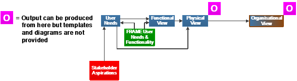
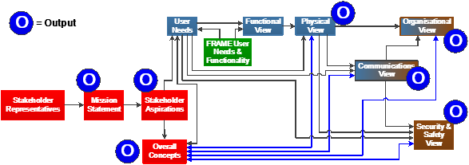
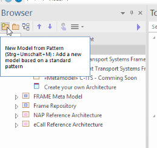
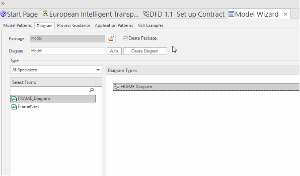
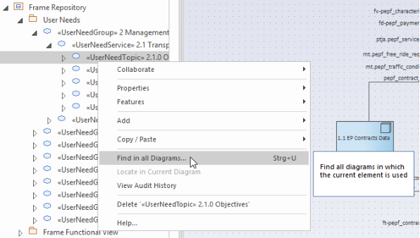
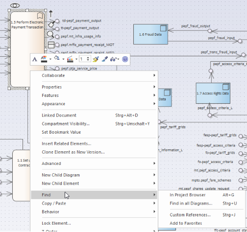
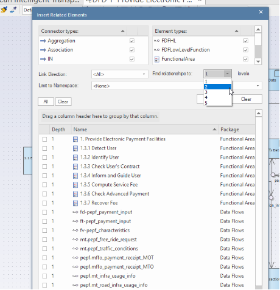

# Methodology for creating sub-set ITS architectures from the FRAME Architecture

This section describes the methodology for the way in which End Users are expected to use the FRAME Architecture to create their own sub-set ITS architectures from it in order to support the ITS services that their stakeholders wish to deploy.  It is an expanded version of the original methodology which is shown in [Figure 2](#_ref15987246) below.

## Basic principles

In the beginning of the process of service design, there is often a rough idea or an obligation to create some service with a certain functionality. A lot of details are not yet clear, but they will be of crucial importance to the success of the service. Taking this into account, the extended FRAME Architecture provides a flexible guide to structure the ideas and identify necessary parts for the service creation and delivery. The following four basic principles apply to the process of creating any ITS architecture:

1. The order of filling in the building blocks is rather a recommendation then a strict rule.
1. The elements within the building blocks are not mandatory. They should be used as and when they are deemed relevant to the service(s) included in the (reference) ITS architecture, although it is recommended to also note the decision to leave an aspect out. 
1. Often only an unclear idea of a service exists, so that the building blocks cannot be filled in directly but can be completed at a later stage, when more information is available.
1. The work on an architecture is always an iterative task. Often the definition of one part of the ITS Architecture has implications on another, which might not be specified yet. 

*Figure 4 - Original methodology for the creation of sub-set ITS architecture from the FRAME Architecture*

Since 2002 the previous FRAME related projects and the FRAME Forum (the FRAME Architecture user group) have provided many training seminars and workshops to explain how the original methodology should be used.  In addition, a number of ITS Architecture sub-sets have been created for clients by members of the FRAME Forum.  Thus during this time the methodology has been honed and refined as a result of experience gained from its use.  The seminars and workshops also included advice for End Users on how to create a Communications View from the Physical View as well as other aspects of ITS implementation, such as the need for an ITS Vision and ITS Mission statements that would help to focus the minds of Stakeholders when they were being asked to create the initial Stakeholder Aspirations.

## The updated FRAME methodology

The updated FRAME methodology formalises the creation of ITS Vision and Mission statements. It also includes other factors, including:

1) The roles of stakeholders in the deployment of the ITS services;
1) The creation of the Stakeholder Aspirations in which the stakeholders describe, in their own words, the services that the ITS deployment is to provide;
1) The identification of the actors to be involved in the specification and creation of all the things (software, hardware, communications, documentation, etc.) that form part of the ITS deployment;
1) An assessment of the benefits the ITS Services will provide;
1) More formal ways to define the Communications View including the use of standards;
1) An expanded Organisational View;
1) A Safety and Security View.

This updated FRAME methodology is illustrated by the diagram shown in [Figure 3](#_ref16005468) below.

*Figure 5 - Updated FRAME methodology for the creation of sub-set ITS architecture from the FRAME Architecture*

The artefacts to be included in the updated FRAME methodology are a mixture of those that have been used since 2002, plus new artefacts that have been identified from the results of work in other Activities within the FRAME NEXT project.  Note that the "blue" lines in [Figure 2](#_ref15987246) indicate revisions that may be needed as a result of work to create the four Views (Physical, Communications, Organisational and Security & Safety).  Indeed, this may in fact be an iterative process where changes to one View may require changes to one of more of the other Views, including the Functional View.

A new tool will be used to replace the existing FRAME Selection Tool.  It will be able to provide textual outputs in templates created by the FRAME End Users.  It is also intended that the new tool will enable the output of diagrams for the Physical, Organisational and (possibly) Communications Views.

A more detailed discussion of the updated methodology will be found in the deliverable documents being produced by Activity 3 and a further Activity 4.2 deliverable that will provide the details about the new FRAME End User Tool which will replace the existing FRAME Selection Tool.

## Using the FRAME Architecture Tool

The FRAME Architecture Tool consists of a three content levels, which build upon one another. The FRAME Toolbox represents the basic logic within the FRAME architecture and this is not changeable for the Enduser. Based on the Toolbox the FRAME Metamodel is built up to show and describe the FRAME elements and connections. The FRAME Repository is based also on the FRAME Toolbox and contains the long-lasting experience and knowledge of the FRAME functionalities and User Needs.

The next content level are the FRAME Reference Architectures which are using the FRAME Toolbox and the elements of the FRAME Repository.

To work with the tool any object and related connection can and should be used. There are basic principles to work within Enterprise Architect witch should be considered. **If these principles are not fulfilled it is possible to damage the content of the FRAME Architecture Tool.**

### Basic Work routine

To create an own architecture the following working steps should be fulfilled:

- Create a new Package or use the User Architecture Template
- Find related FRAME functionalities and objects
- Copy Object-Links into your architecture
- Extend your Architecture

#### Create a new Package or View

A Package represents a subfolder in the FAT hierarchy and determine a closed section in the Projectbrowser.

### Function Find Objects – Project Browser

### Function Find Objects – Model Window

In Project Browser

In Diagrams

### Function Insert RELATED Objects – Model Window

Function Insert RELATED Objects – Model Window

Levels: Defines the instances of related objects

### Insert new Objects

Difference Link and Instance

Link:

Make a shadow copy of an object

Important! The original object stays in place.

Instance:

A NEW object is generated!

All Links and Connections get lost!

### How to delete Objects and Links

## Generate and Publish your own reference architecture

**purpose**: to give reader (user) information about creation of his/her own the architecture either from scratch or from existing reference architecture. How to work with predefined structure of the reference architecture. Leading to empty reference architecture structure.

**contents**:

- introductory graphics (…) and few lines of what is described here
- a clickable box for empty reference architecture

