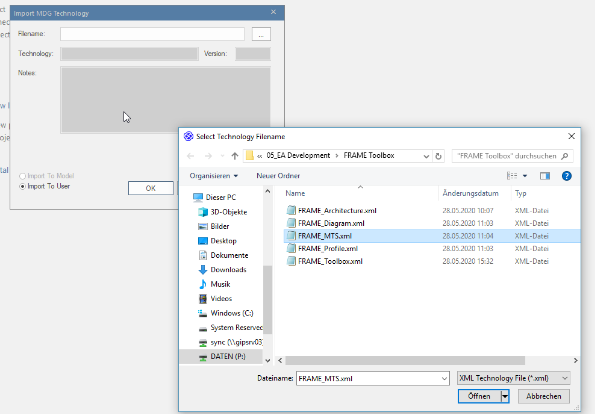

# Update the FRAME Architecture Tool

## Import FRAME TOOL BOX

### Open a EA project file

Link: <https://files.austriatech.at/#my-libs/lib/5ffeff21-ba3f-48cd-9424-2f1ab336774e/06_EA%20Development/FRAME%20Toolbox>

### Download the Toolbox from Filerepository

…or generate a new.

### Import MDG File

Go to Spezialize / PublishTech / Import MDG Technology

Select within the filename the FRAME\_MTS file from the downloaded Toolbox:

And Press OK.

